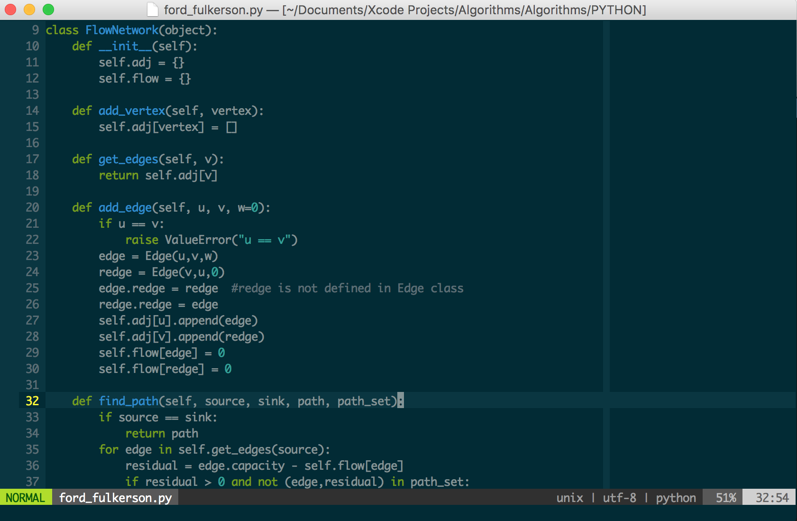

# vim-starter-kit
Basic Vim configuration for users switching to Vim from other modern editors.

## Installation
* First backup you existing `~/.vimrc` file and `~/.vim` folder. (Not needed if you haven't used VIM before)
* Clone the repository. 

  ```bash
  $ git clone https://github.com/satyapr93/vim-starter-kit.git ~/.vim
  ```
* Symlink g(vimrc) from `~/.vim` to your home directory.

  ```bash
  $ ln -s ~/.vim/vimrc ~/.vimrc
  ```
  
  ```bash
  $ ln -s ~/.vim/gvimrc ~/.gvimrc
  ```
* Install Vim plugins

  ```bash
  $ vim +PlugInstall 
  ```
* Enjoy.

## Modifier Keys (Ctrl, Meta, Leader, Shift)
* `C-x` (Control + x)
* `M-x` (Meta + x)
* `S-x` (Shift + x)
* `<leader>x` (Leader, x)
I've modified `Leader` key to `<Space>` (default `Leader` = `\`) for the convenient. You can set your own `Leader` key and `Meta` key.

## Shortcuts
These are the Shortcuts I have added in `~/.vimrc`.

* `<Arrow keys>` : `NOP` (Arrow key for navigating file doesn't work, use `hjkl` instead)
* `<jk>` : `<ESC>` (to switch to Normal mode from Insert mode, press `jk`)
* `<;>`  : `<:>` (Switch to command mode form normal mode bye pressing `;(:)`)


