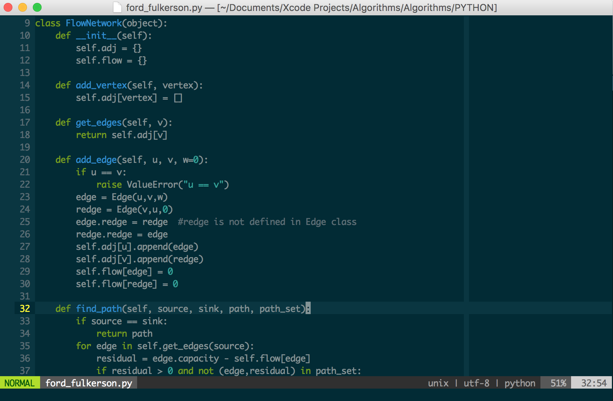
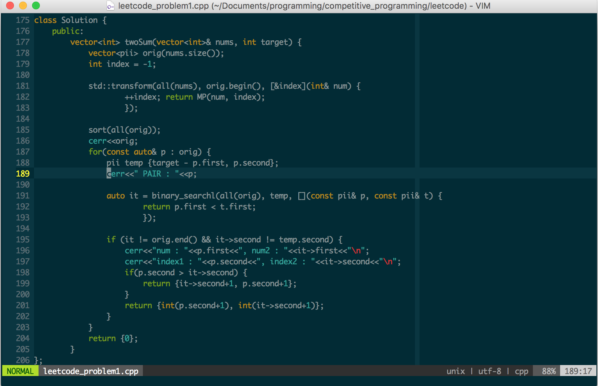

# vim-starter-kit
Basic Vim configuration for users switching to VIM from other modern editors (Sublime-text, Atom).

## Installation
* First backup you existing `~/.vimrc` file and `~/.vim` folder. (Not needed if you haven't used VIM before)
* Clone the repository. 

  ```bash
  $ git clone https://github.com/satyapr93/vim-starter-kit.git ~/.vim
  ```
* Symlink g(vimrc) from `~/.vim` to your home directory.

  ```bash
  $ ln -s ~/.vim/vimrc ~/.vimrc
  ```
  
  ```bash
  $ ln -s ~/.vim/gvimrc ~/.gvimrc
  ```
* Install Vim plugins

  ```bash
  $ vim +PlugInstall 
  ```
* Enjoy.

## Modifier Keys (`Ctrl`, `Meta`, `Leader`, `Shift`)
* `C-x`       (Control + x)
* `M-x`       (Meta + x)
* `S-x`       (Shift + x)
* `<leader>x` (Leader, x)

I've modified `Leader` key to `<Space>` (default `Leader` = `\`) for the convenient. You can set your own `Leader` key and `Meta` key.

## Shortcuts
These are some of the Shortcuts you should know.

* `<Arrow keys>` : `NOP` (Arrow key for navigating file doesn't work, use `hjkl` instead)
* `<jk>` : `<ESC>` (to switch to Normal mode from Insert mode, press `jk`)
* `<;>`  : `<:>` (Switch to command mode form normal mode bye pressing `;(:)`)
* `<C-p>` or `<leader>o` : Quickly open files using fuzzy search (Ctrl-P)
* `<C-n>` : Multiple cursor editing (inspired from Sublime-text `<C-d>`)
* `/` : Search for strings in current file
* `<Enter>` : Visually select nearest scope. Press again to increase the selection scope.
* `<leader>`(motion-commands<hjkl,wb>) : Easymotion commands for fast navigation
* `<C-d>` : Page down (Half)
* `<C-u>` : Page up (Half)
* `gg` : go to top of the file.
* `<S-g>` or `G` : go to end of the file.
* `<S-m>` or `M` : go to middle of the frame.
* `o` : Insert a new line after the current line and start editing.
* `<S-o>` or `O` : Insert a new line before current line and start editing.
* `<S-a>` or `A` : Go to end of the line and start editing.
* `<S-i>` or `I` : Go to start of the line and start editing.


You can define you own key mapping for most used commands and functions by editing the file `~/.vimrc`.

## Screenshots





